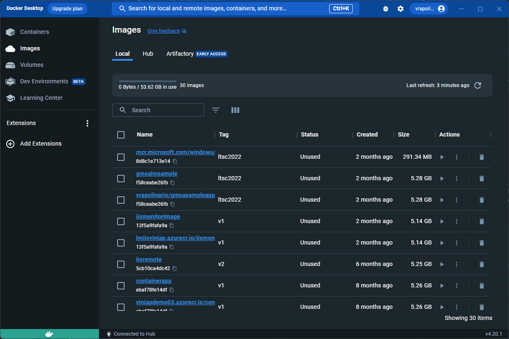
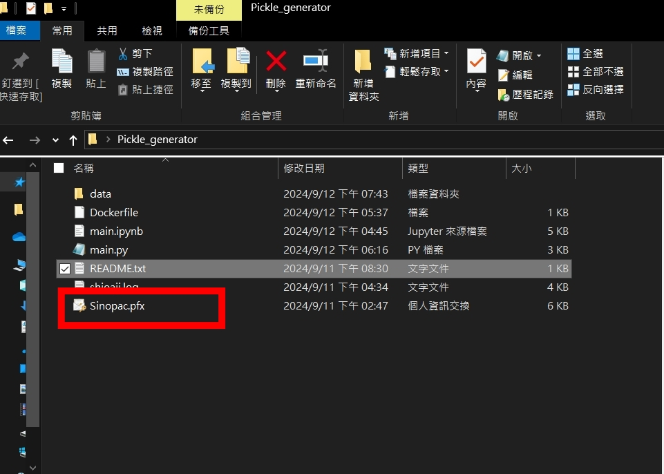
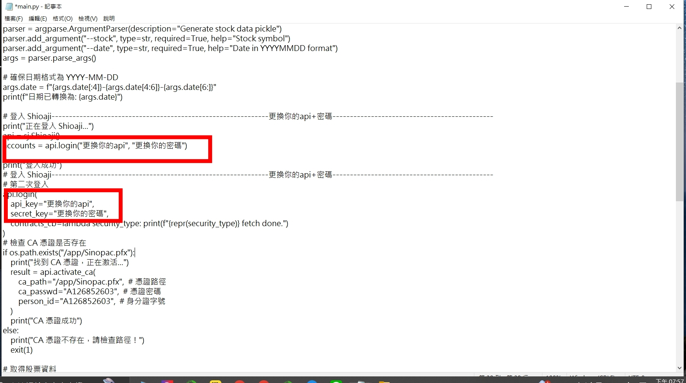
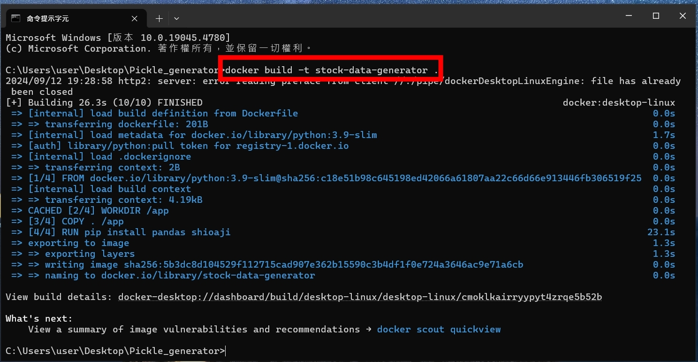
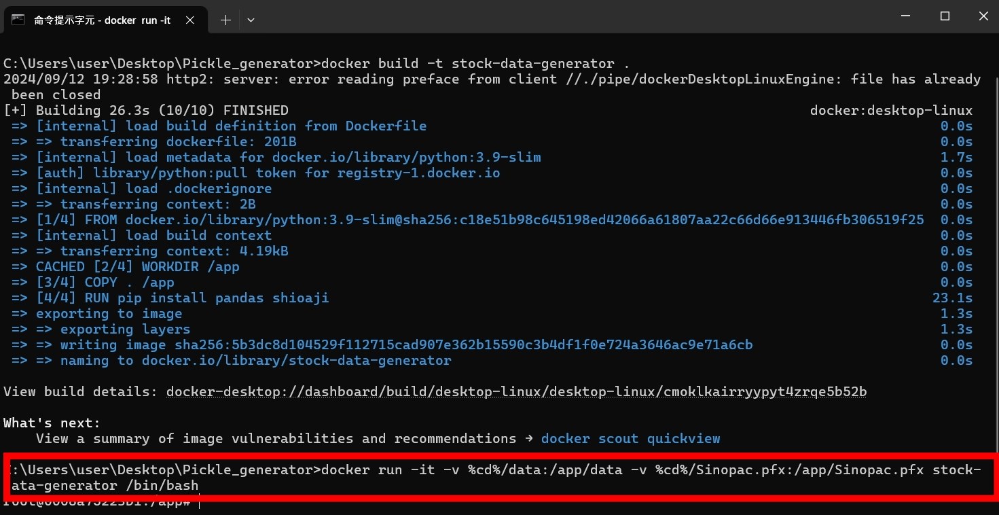
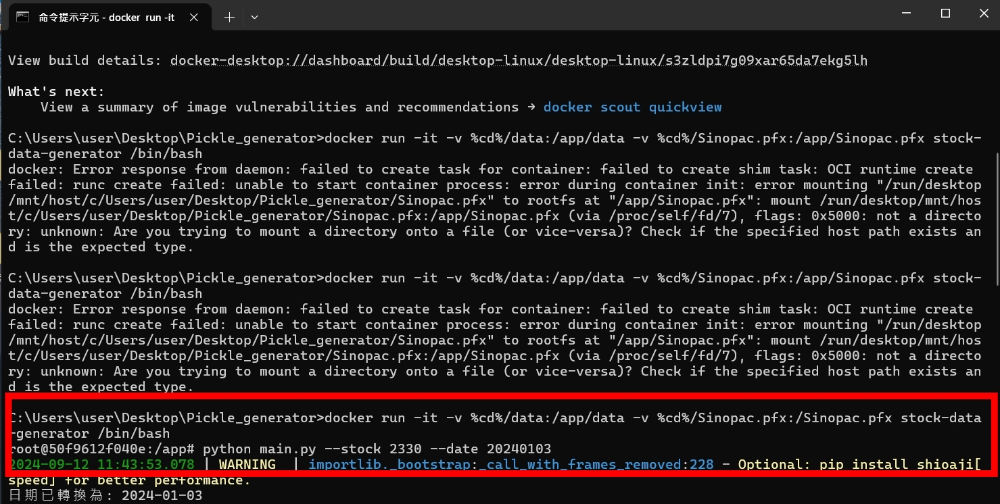
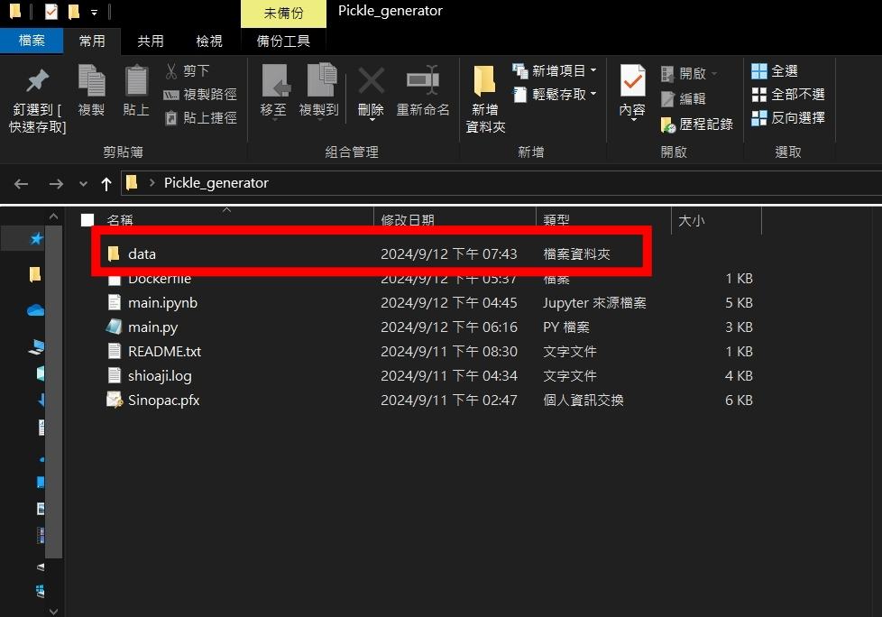
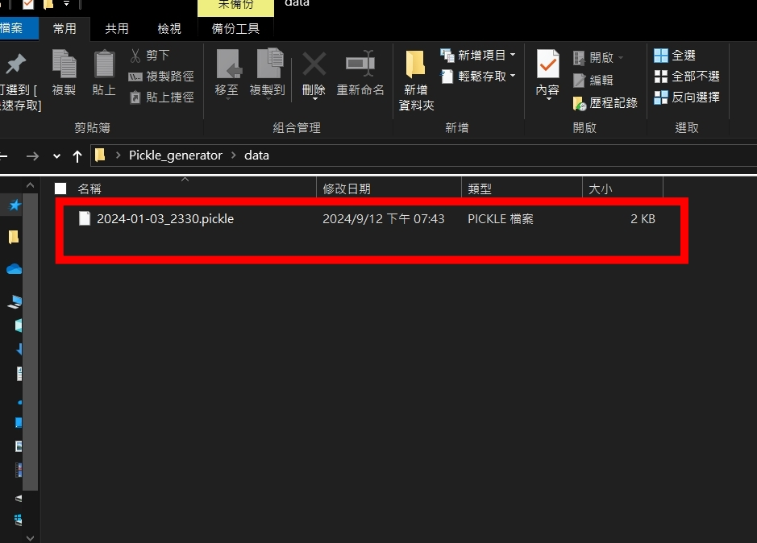

### STEP0 先解壓縮 Pickle_generator 檔案包，並確認已安裝 Docker 應用程式。

### STEP1 打開資料夾Pickle_generator

### STEP2 將你的憑證檔案 Sinopac.pfx 放入 Pickle_generator 資料夾
  

### STEP3 打開main.py將你的api&密碼填上於正確的地方 
### (裡面有標註)

### STEP4 在 Pickle_generator 資料夾中打開終端機執行以下命令來 build Docker 映像檔：

## `docker build -t stock-data-generator . `

### STEP5 執行以下命令來啟動 Docker 容器，並掛載憑證 (Sinopac.pfx) 和資料目錄 (data)：

## `docker run -it -v %cd%/data:/app/data -v %cd%/Sinopac.pfx:/Sinopac.pfx stock-data-generator /bin/bash`

### STEP6 當終端顯示 `root@0008a75223b1:/app#` 時，運行以下命令來生成 pickle 檔案： 其中 2330 是股票代碼，20240103 是日期（格式：YYYYMMDD）
## `python main.py --stock 2330 --date 20240103`

### STEP7 生成的 pickle 檔案將保存到 Pickle_generator/data 資料夾中。

